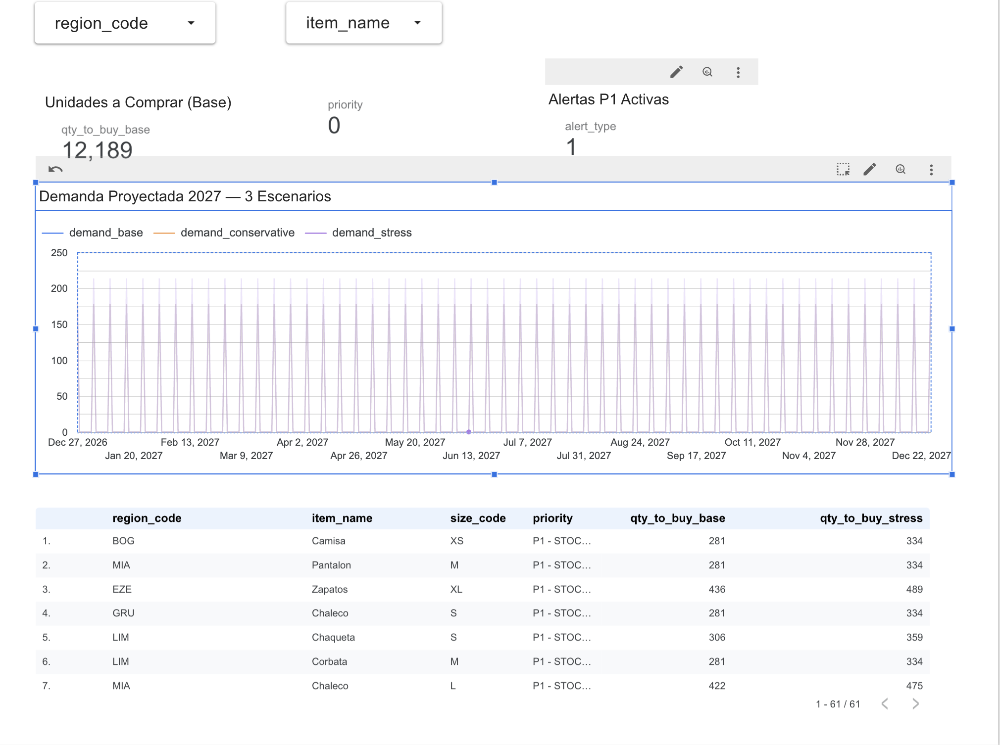
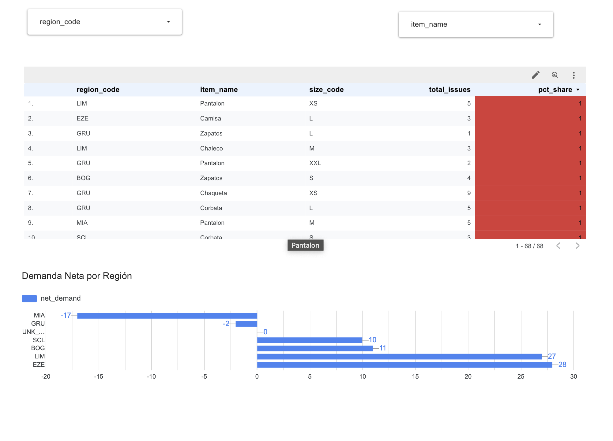
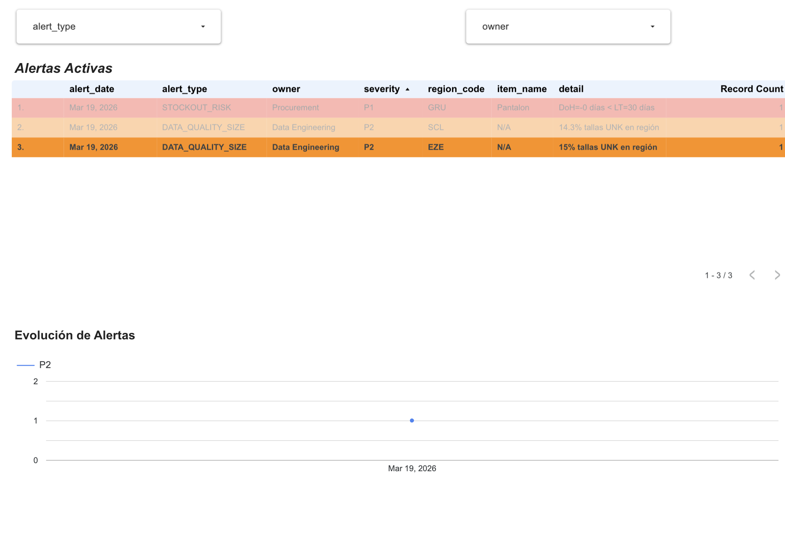

# Uniform Demand & Stock Reco 2027
Portfolio de Data Analyst — BigQuery · GCP · Looker Studio

## Objetivo
Ciclo completo de análisis de demanda y recomendación de compra de
uniformes para una aerolínea LATAM: desde datos crudos hasta dashboard ejecutivo.

## Stack
- BigQuery (SQL avanzado, modelado dimensional, forecasting en SQL)
- Google Cloud Platform (GCP)
- Looker Studio (dashboards ejecutivos)
- Google Sheets (output accionable para equipos no técnicos)

## Mini-proyectos
| # | Nombre | Entregable |
|---|---|---|
| 0 | Setup | Entorno GCP + VS Code + repo |
| 1 | Staging | stg_*_clean en BigQuery |
| 2 | Dimensional | dim_* + fct_* |
| 3 | KPIs | mart_kpis_weekly |
| 4 | Forecast | mart_demand_forecast_2027 |
| 5 | Compra | mart_purchase_reco_2027 |
| 6 | Alertas | mart_alerts_daily |
| 7 | Dashboard | Looker Studio (3 páginas) |
| 8 | Sheets | Executive pack |

## Convenciones SQL
- Prefijos: `stg_` · `dim_` · `fct_` · `mart_`
- Fechas: UTC, formato DATE (YYYY-MM-DD)
- Cantidades: unidades enteras (INTEGER)
- Tallas válidas: XS · S · M · L · XL · XXL · UNK
- Regiones válidas: SCL · LIM · BOG · GRU · EZE · MIA

## Dashboard Looker Studio

Link: [Ver dashboard](https://lookerstudio.google.com/reporting/e06687b5-e038-4316-94be-3739edc206b8/page/srjsF/edit)

### Páginas

| Página | Descripción | Fuentes de datos |
|---|---|---|
| Executive Overview | KPIs generales, demanda proyectada 2027 y top críticos | mart_purchase_reco_2027, mart_demand_forecast_2027 |
| Operación | Heatmap talla × región y demanda neta por región | mart_size_heatmap, mart_kpis_weekly |
| Alertas y Riesgos | Alertas activas P1/P2 con owner y detalle | mart_alerts_daily |

### Capturas

